# PyTorch Learning Exercise

This repo contains some basic PyTorch exercises
on building, training and making predictions using basic linear regression and classification models.

It follows this original tutorial by Daniel Bourke:
https://www.youtube.com/watch?v=Z_ikDlimN6A&t=2s

## What's in This Repo

[src](src):
- [model.py](src/models.py) - Contains custom model classes.
- [ml_helpers.py](src/ml_helpers.py) - Various train, test and prediction helper functions.
- [plotting_helpers.py](src/plotting_helpers.py) - Functions for visualizing initial dataset and model results.
- [data_helpers.py](src/data_helpers.py) - Functions for data scanning and processing.
- [metrics_funcs.py](src/metrics_funcs.py) - Main metric functions used for assessing the model implemented by hand.

[tests](tests) - Contains scripts for testing implemented models and helper functions:

### Simple Linear Regression Model

This baseline model for linear regression is implemented in class SimpleLinearRegressionModel.
Model is tested on dummy data.

| Linear Regression Model - No Predictions                  | Linear Regression Model - Predictions                  |
|-----------------------------------------------------------|--------------------------------------------------------|
| 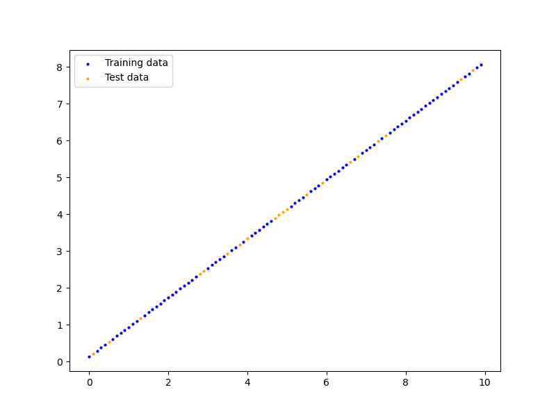 | 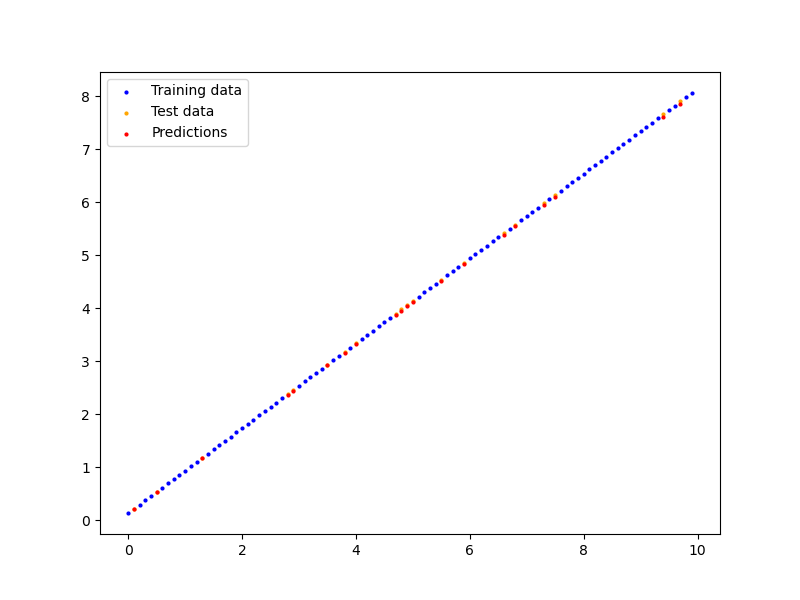 |

- testing code: [simple_lin_reg_model](tests/simple_lin_reg_model)

### Binary and Multiclass Circle classification

Binary Classification Model of class CircleBinClassModel classifies
two classes of circles created using sklearn.datasets.make_circles().

Multiclass model classifies 4 classes of circles created using sklearn.datasets.make_blobs().
Two models are implemented:
- class CircleMultiClassModel_Linear: simple linear classifier
- of class CircleMultiClassModel_NonLinear: contains non-linear activations
These two models are compared and give similar predictions.

| Binary Classification                                                        | Multiclass Classification                                  |
|------------------------------------------------------------------------------|------------------------------------------------------------|
| 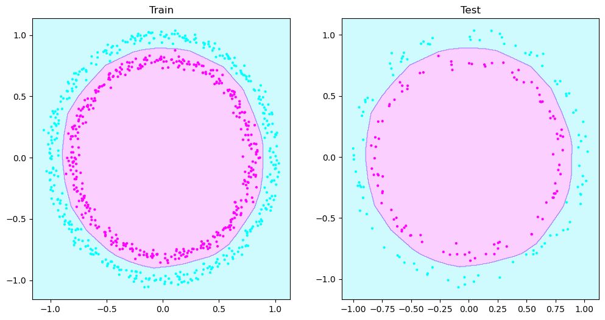 | 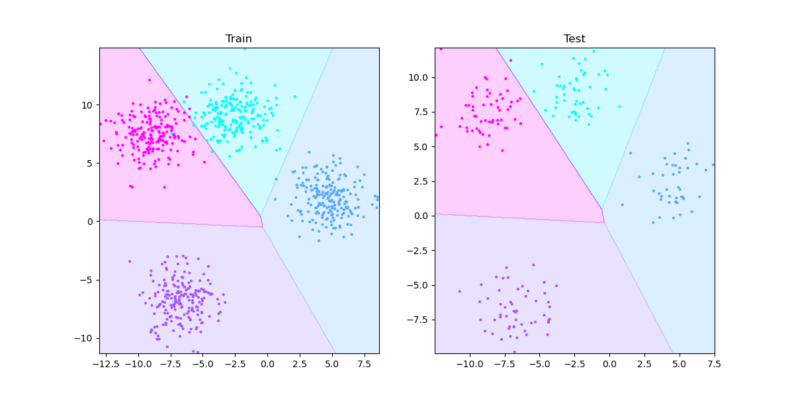 |

- testing code: [circles_binary_classification](tests/circles_binary_classification) 
and [circles_multiclass](tests/circles_multiclass)

### FashionMNIST Classification

Models are trained to recognize different types of clothing.
Dataset is created using torchvision.datasets.FashionMNIST().
Three different classification models are implemented and compared:
- class ImageClassLinear: baseline linear model
- class ImageClassNonlinear: contains non-linear activations
- class ImageClassCNN: uses TinyVGG-based convolutional neural network

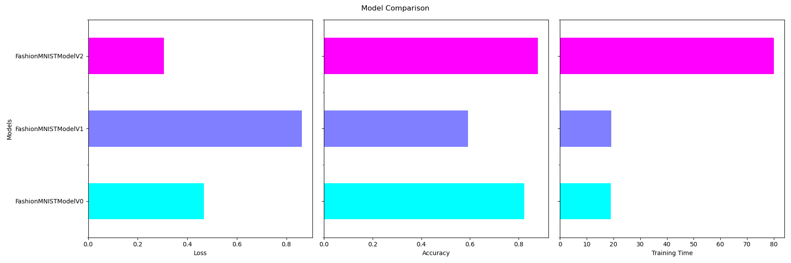

CNN model has the best loss and accuracy results, but it takes significantly longer to train.
Simple linear model's results in terms of accuracy and loss are comparable to CNN model, and it trains much faster.
Nonlinear model doesn't seem to bring any benefits.

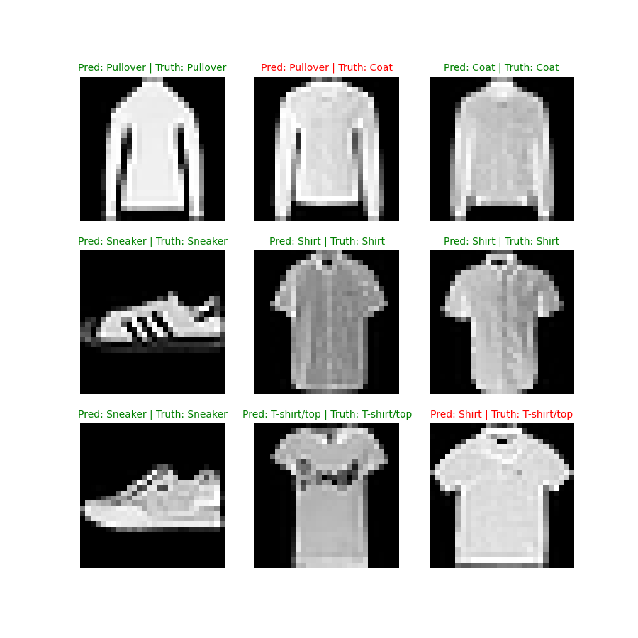

Valuable insights are also provided by confusion matrices.

| Linear Model                                               | Non-linear Model                                               | CNN                                                      |
|------------------------------------------------------------|----------------------------------------------------------------|----------------------------------------------------------|
| | 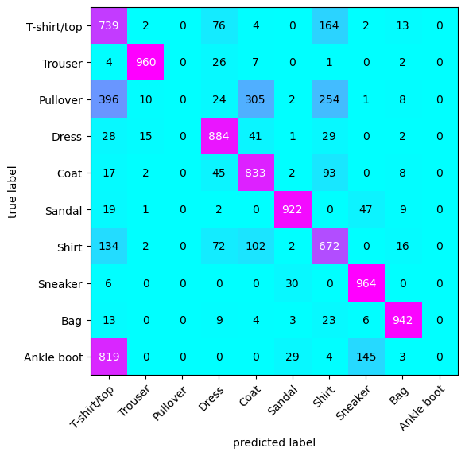 | 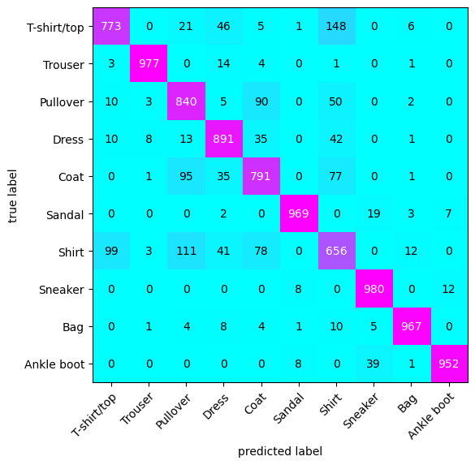 |

- testing code: [fashionMNIST_classification](tests/fashionMNIST_classification)

### Food Classification

Models are trained to differentiate between different kinds of food.
For training a subset of Food 101 dataset containing 3/101 classes (specifically: pizza, steak, and sushi)
and 10% of images (~75 training, ~25 testing) is used.
This dataset can be loaded using built-in data loading functions,
as well as an implemented custom data loading function.

Two TinnyVGG-based models of class ImageClassCNN are used.
One is trained on data without any augmentations, 
while the other is trained on data augmented using TrivialAugmentWide.

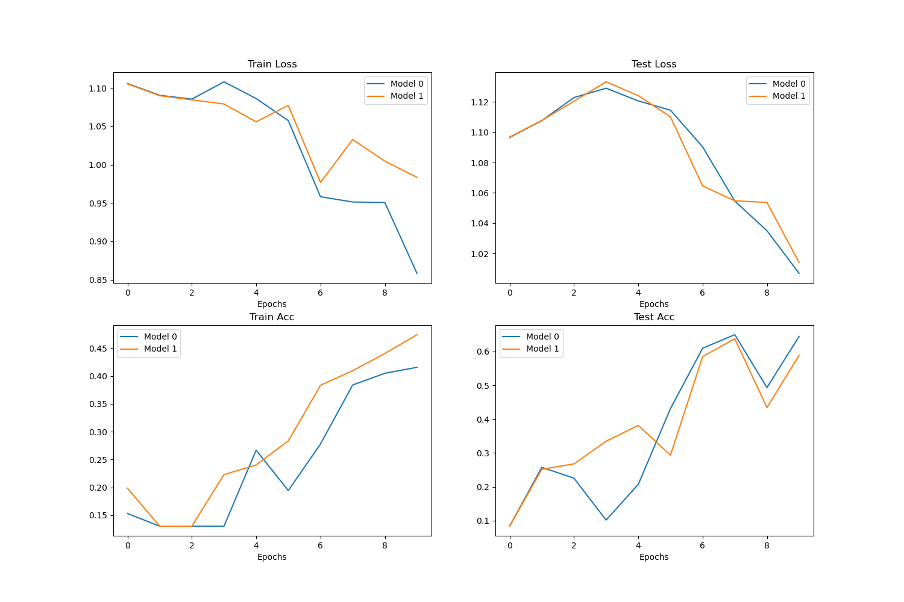

Model trained on augmented data is used to make prediction on custom image.
Although the prediction is correct,
small training time, accuracy and loss values, as well as prediction probability 
suggest that this can't be taken as sign that model is by any means well-trained.

Small amount of data turns out to be quite limiting since a CNN based model is used.
While observed trend for accuracy and loss is generally in the right direction 
model should be trained on larger dataset and fine-tuned.

| Original image                                                          | Model prediction                                             |
|-------------------------------------------------------------------------|--------------------------------------------------------------|
| 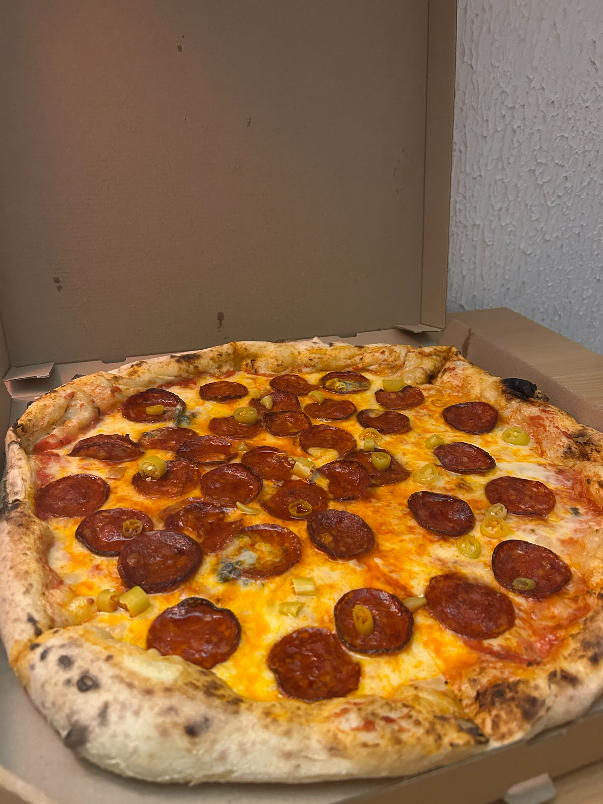 | 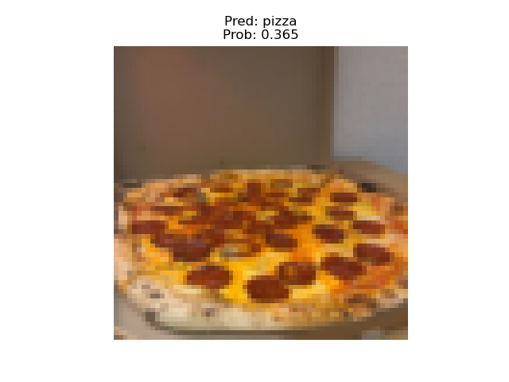 |

- testing code: [food_classification](tests/food_classification)

## Requirements

All requirements are listed in [requirements.txt](requirements.txt).

Additionally, test scripts are implemented as Jupyter Notebooks so make sure you can run them.
